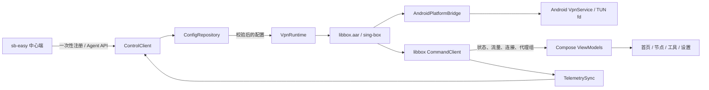

# sb-easy Android 客户端设计

> 状态：完整受管客户端已实现并通过自动化/端到端预检（待一次性真机验收）
>
> 日期：2026-08-01
>
> 目标：在无 root、无外部二进制的 Android 设备上运行 sb-easy Client，并继续由中心端统一下发代理、路由与 QuickJS 生成的规则。

## 1. 结论

方案可行，推荐实现一个原生 Android 客户端，而不是把 Linux C++ Agent 直接交叉编译进 APK：

- UI、设备注册、配置同步使用 Kotlin + Jetpack Compose。
- sing-box 核心使用官方 `libbox.aar` 嵌入 App，不启动外部进程。
- TUN 由 Android `VpnService` 创建，文件描述符通过 libbox 的 `PlatformInterface` 交给 sing-box。
- 复用现有 `/api/agent/*` 配置、命令、状态、遥测和延迟协议；Android 只重新实现客户端，不复制 C++ HTTP 代码。
- QuickJS 仍只在中心端执行。Android 收到的是已经生成并校验过的最终规则，同时显示规则来源、配置版本与实际路由测试结果。

这条技术路线已经有两层官方依据：Android 为第三方 VPN 提供 `VpnService`、per-app VPN 和 always-on VPN；sing-box 官方 Android 客户端同样使用 Kotlin、`VpnService` 和 `libbox.aar`。初版应固定 sing-box/libbox `1.13.12`，与当前 sb-easy 镜像内置版本一致，避免服务端渲染配置与手机核心出现版本漂移。

## 2. 产品边界

### 2.1 MVP 必须完成

- 扫描二维码或手工输入服务器与一次性注册码完成设备注册。
- 拉取该设备专属配置，支持 ETag/304、手动刷新与前台增量同步。
- 请求系统 VPN 授权，启动、停止并恢复内嵌 sing-box。
- 展示真实连接状态、当前代理组、上下行速率、累计流量和连接数。
- 展示代理组与节点延迟，并允许切换 selector 节点。
- 输入 HTTP/HTTPS URL，实测并显示最终走的出站、规则与代理链。
- 可读配置视图与 JSON 视图；显示配置来自 Profile 还是 QuickJS。
- 新配置校验失败时继续使用 last-known-good，不中断正在工作的 VPN。
- 将状态、遥测、测速结果和中心端命令确认接回现有 Agent API。

### 2.2 MVP 不做

- 不把中心管理后台搬进 App，不允许手机持有管理员 JWT 或密码。
- 不在手机上执行或编辑 QuickJS 脚本。
- 不在 Android 上暴露 `0.0.0.0` 的本地管理网页或 Clash API。
- 不支持任意本地 JSON 覆盖中心配置；本地只保存明确的设备级设置。
- 不直接复用 C++ Agent 进程管理、systemd、Docker、Linux 网卡或外部 sing-box 路径。

## 3. 现状复用评估

| 能力 | 当前接口 | Android 处理 | 结论 |
| --- | --- | --- | --- |
| 设备鉴权 | per-host Bearer Token | Keystore 加密后本地保存 | 可复用 |
| 配置同步 | `GET /api/agent/config`、ETag/304 | 前台服务轮询，停用时手动/低频同步 | 可复用 |
| QuickJS 标识 | `X-SB-Easy-Rule-Source` | 显示“QuickJS 生成”徽标 | 可复用 |
| 状态心跳 | `POST /api/agent/status` | 上报 App/Core/VPN 状态 | 小幅扩展 |
| 命令下发 | `GET /api/agent/commands` + ack | 映射 reload/restart/test-proxies | 可复用 |
| 实时遥测 | `POST /api/agent/telemetry` | 从 libbox command stream 采样 | 可复用 |
| 节点测速 | `POST /api/agent/proxy-latency` | libbox `URLTest` 后批量上报 | 可复用 |
| 安全注册 | 目前由管理员直接查看长期 Token | 一次性注册码换取长期 Token | 必须新增 |
| Android 配置 | 默认 Profile 含 Linux TUN/mixed/网卡字段 | 新增 Android 专用 Profile | 必须新增 |
| 本地路由测试 | C++ Agent 通过本地 mixed inbound + Clash API | 由 App 发起探测并关联 libbox connection event | Android 原生实现 |

现有 `hosts.capabilities` 是开放 JSON，可以先增加以下能力而不改 hosts 表结构：

```json
{
  "runs_singbox": true,
  "is_wg_member": false,
  "is_wg_hub": false,
  "is_self": false,
  "platform": "android",
  "supports_vpn": true,
  "supports_url_route_test": true
}
```

Android 手机默认不是 WireGuard Host member；它的流量由本机 sing-box/TUN 接管。以后若确实需要把手机作为 WG mesh 节点，再单独增加 endpoint 配置。

## 4. 目标架构



### 4.1 Gradle 模块

初版控制在三个模块，避免过早拆成大量 feature module：

```text
android/
├── app/                 # Compose UI、导航、VpnService、通知、二维码
├── core/                # Agent API、仓储、状态机、加密存储、同步任务
├── libbox-bridge/       # libbox AAR、PlatformInterface 与类型适配
└── scripts/
    └── build-libbox.sh  # 从固定 sing-box tag 构建并校验 AAR
```

核心技术选择：

- Kotlin、Coroutines/Flow、Jetpack Compose Material 3。
- OkHttp；VPN 启用时使用明确的 underlying `Network.socketFactory` 访问控制面。
- DataStore 保存普通偏好；配置快照与事件历史使用 Room 或原子文件。
- Android Keystore 生成不可导出的 AES-GCM key，用它加密 Agent Token。
- libbox 通过官方 gomobile 构建脚本生成 AAR，所有调用收敛在 `libbox-bridge`，防止 experimental API 扩散到 UI。
- `minSdk 24`、`targetSdk 36`，至少产出 `arm64-v8a` 和 `x86_64`；发布包再决定是否保留 32 位 ABI。

不建议增加 C++/JNI 控制面：Kotlin 重写现有少量 HTTP 协议比维护 C++、JNI、Drogon 和 libbox 两套 native runtime 更简单，也更容易正确接入 Android 生命周期。

## 5. VPN 与核心生命周期

### 5.1 服务职责

`SbEasyVpnService : VpnService` 是唯一长期运行组件：

1. 进入前台并持续展示不可隐藏的连接通知。
2. 初始化 libbox command server 与 Android platform bridge。
3. 将 TUN options 转换成 `VpnService.Builder` 的 address、route、DNS、MTU 和 per-app 列表。
4. `Builder.establish()` 后把 TUN fd 交给 libbox。
5. 保护 sing-box 与 sb-easy 控制面的底层 socket，防止再次进入 TUN 形成路由环。
6. 监听底层 Wi-Fi/蜂窝网络变化并通知 libbox；必要时设置 `setUnderlyingNetworks()`。
7. 处理 `onRevoke()`、进程回收、配置 reload、通知停止和 fd 关闭。

Manifest 中的 VPN Service 必须 `exported=false`、要求 `BIND_VPN_SERVICE`，并使用 VPN 可用的 `systemExempted` 前台服务类型。基础权限为：

- `INTERNET`、`ACCESS_NETWORK_STATE`
- `FOREGROUND_SERVICE`、`FOREGROUND_SERVICE_SYSTEM_EXEMPTED`
- `POST_NOTIFICATIONS`（Android 13+ 运行时申请）
- `CAMERA`（仅扫码时申请）

第一阶段显式声明暂不支持 always-on；通过进程回收、系统设置启动和配置恢复测试后再开启。per-app VPN 放到第二阶段，因为切换应用名单必须重建 TUN，并且上架 Google Play 时还涉及应用可见性政策。

### 5.2 运行状态机

```text
UNENROLLED
    └─ 注册成功 → DISCONNECTED
DISCONNECTED
    └─ 连接 → SYNCING → PERMISSION_REQUIRED → STARTING → CONNECTED
CONNECTED
    ├─ 新配置 → VALIDATING → RELOADING → CONNECTED
    ├─ 用户停止 / 系统撤销 → STOPPING → DISCONNECTED
    └─ 网络或核心异常 → DEGRADED → 自动恢复或 ERROR
```

状态只由 `VpnRuntime` 生成，Activity 通过 Flow 观察，不直接控制 libbox。这样旋转屏幕、Activity 重建或 App 退到后台不会改变 VPN 状态。

### 5.3 配置事务

收到新的 ETag 后按以下顺序处理：

1. 下载到 `candidate`，记录 ETag、Profile 与 `X-SB-Easy-Rule-Source`。
2. 使用 `Libbox.checkConfig(candidate)` 做语法和核心兼容校验。
3. 未连接时原子写入 `last-known-good`；已连接时调用 `startOrReloadService`。
4. reload 成功后再提交新的 ETag 和快照。
5. reload 失败则保持当前核心和旧配置运行，记录错误并上报中心端。

不能先覆盖唯一配置再尝试启动，否则一个错误 Profile 会同时切断数据面和配置修复通道。

### 5.4 控制面不能依赖 VPN 自己

Agent API 的 HTTP 请求要绑定到一个具备 Internet 且 `NOT_VPN` 的 underlying network，不能默认跟随系统 VPN 路由。否则配置导致核心无法联网时，手机也无法拉取修复配置。

网络切换时由 `ConnectivityManager.NetworkCallback` 选择新的 Wi-Fi/蜂窝网络，重建控制面客户端；普通 URL 路由测试则刻意不绑定 underlying network，让探测流量进入 TUN。

## 6. Android 专用 Profile

中心端新增一个受管 Profile：`Android Client`。它与 Linux 默认 Profile 的差异是：

- 只有 `tun` inbound，不开放 `mixed-in :7890`。
- 不包含 `exclude_interface` 中的 Docker、WireGuard 或 Linux 网卡名。
- TUN 使用 Android/libbox 支持的 address、auto-route、strict-route 和 mixed stack。
- 默认不注入对外 Clash API；App 通过 libbox command API 读取状态和切换代理。
- DNS、路由和 outbounds 仍由中心端生成，QuickJS 仍可以依据 `host.capabilities.platform === "android"` 生成手机专属规则。
- 本地 per-app include/exclude、允许绕过、IPv6 开关通过 libbox `OverrideOptions`/TUN options 应用，不修改中心规则。

中心端最好给 `/api/agent/config` 再增加两个向后兼容的响应头：

- `X-SB-Easy-Profile-Id`
- `X-SB-Easy-Profile-Name`

App 的“配置”页面展示可读摘要、最终路由规则和 JSON。QuickJS 页面只显示“本配置的路由规则由中心 QuickJS 生成”、ETag 和同步时间；脚本源码与编辑权限继续留在管理后台。

## 7. 安全注册与 API 增量

### 7.1 注册流程

管理员在 Web 管理端点击“添加 Android 设备”：

1. 中心创建 Host，自动选择 Android Profile，`is_wg_member=false`。
2. `POST /api/hosts/{id}/enrollment-codes` 生成 10 分钟有效、单次使用的随机注册码。
3. Web 显示 `sbeasy://enroll?...` 二维码和短码。
4. App 扫码后通过 HTTPS 调用 `POST /api/agent/enroll`。
5. 中心在同一数据库事务内校验、消费注册码，返回 host id 和长期 Agent Token。
6. App 用 Keystore 加密 Token，立即拉取首份配置；注册码从此失效。

注册码数据库只保存高熵 code 的哈希：

```sql
CREATE TABLE agent_enrollments (
    id          TEXT PRIMARY KEY,
    host_id     TEXT NOT NULL,
    code_hash   TEXT NOT NULL UNIQUE,
    expires_at  TEXT NOT NULL,
    redeemed_at TEXT,
    created_at  TEXT NOT NULL DEFAULT (datetime('now'))
);
```

注册请求建议为：

```json
{
  "code": "one-time-secret",
  "device": {
    "name": "Pixel 10",
    "platform": "android",
    "app_version": "0.1.0",
    "core_version": "1.13.12",
    "install_id": "random-install-id"
  }
}
```

注册接口只换取 Agent Token，绝不返回管理员 JWT。管理员删除 Host、停用 Host 或旋转 Token 后，手机下一次请求立即失效；重新授权通过新的单次二维码完成。

### 7.2 现有接口的 Android 映射

| 接口 | App 行为 |
| --- | --- |
| `GET /api/agent/config` | 前台约 10 秒轮询；304 不触碰核心 |
| `POST /api/agent/status` | 上报 App 版本、core 版本、VPN 状态、ETag、最近错误 |
| `GET /api/agent/commands` | reload=重新同步并热加载；restart=重建核心；test-proxies=执行 URLTest |
| `POST .../ack` | 返回成功/失败与简短错误，日志不包含 Token/节点密码 |
| `POST /api/agent/telemetry` | 批量上报速率、总量和连接数；连接详情默认不上报 |
| `POST /api/agent/proxy-latency` | 按节点 tag 回传 delay/null |

停用 VPN 后，不用 10 秒后台轮询。用户打开 App 时刷新，另用 WorkManager 做系统允许的低频同步；VPN 运行期间由前台服务持有同步循环。

## 8. UI 信息架构

整体采用移动端原生布局，视觉上保留 Clash Verge 的清晰卡片、低噪声配色和大连接开关，但不照搬桌面侧栏。

### 8.1 首次使用

- 欢迎页：说明需要一台 sb-easy 中心服务器。
- 加入设备：主操作“扫描二维码”，次操作“手工输入”。
- 校验页：服务器名称、TLS 状态、设备名和分配的 Profile。
- VPN 授权页：解释 Android 即将显示的系统授权弹窗。

这里不是用户名/密码登录页。App 代表一个受管设备，身份是一次性注册后得到的 per-device Token。

### 8.2 底部四个 Tab

| Tab | 主要内容 | 数据来源 |
| --- | --- | --- |
| 首页 | 大连接开关、连接状态、当前策略、上下行、累计流量、连接数、同步时间 | VpnRuntime + libbox status/traffic |
| 节点 | selector 分组、当前节点、节点类型、延迟、单项/全部测速 | libbox groups + URLTest |
| 工具 | URL 路由测试、连接诊断、最近错误、可读配置/JSON | libbox connections + ConfigRepository |
| 设置 | 自动连接、按应用代理、LAN 绕过、IPv6、通知、服务器与设备信息 | DataStore + Android APIs |

首页首屏建议：

```text
┌─────────────────────────────┐
│ sb-easy              已同步 │
│                             │
│       [  已连接  ]          │
│       日本 · Tokyo 01       │
│                             │
│  ↑ 128 KB/s    ↓ 2.4 MB/s  │
│  18 个连接      1.8 GB 累计 │
└─────────────────────────────┘
│ 规则：QuickJS · 配置 a12f…  │
│ 网络：Wi-Fi · 核心 1.13.12  │
```

### 8.3 URL 路由测试

放在“工具”Tab 顶部，首页可放一个最近结果的快捷入口：

1. 用户输入 `https://example.com/path`。
2. App 仅接受 HTTP/HTTPS，去除 URL 中的 user-info，不保存敏感 query。
3. 启动短超时探测请求，让流量正常进入 VPN TUN。
4. 同时订阅 libbox connection events，按目标 host、端口和本 App UID 关联连接。
5. 显示结果：`代理 / 直连 / 阻断`、最终 outbound、完整 chains、命中的 route rule 和耗时。

失败必须区分“规则判定为阻断”“代理拨号失败”“DNS 失败”“没有捕获到连接”，不能把所有错误都显示成网络失败。

### 8.4 配置与 QuickJS 的呈现

“工具 → 运行配置”包含三个子 Tab：

- 概览：入口、DNS、路由规则数、代理组、规则集、配置版本。
- 路由：把 domain、CIDR、端口、协议、出站翻译成人类可读卡片。
- JSON：只读代码视图，可复制、搜索，默认隐藏敏感字段。

顶部始终显示来源：

- `Profile`：模板规则直接生成。
- `QuickJS`：中心脚本已执行，当前展示的是脚本生成后的最终规则。

这样 QuickJS 会真实影响手机路由，又不会把脚本执行权限和管理员配置能力下放到终端。

## 9. 安全模型

- 正式版只接受 HTTPS 中心地址，`networkSecurityConfig` 全局禁止明文；开发 flavor 才允许明确的局域网 HTTP 例外。
- 不提供“忽略所有证书错误”。私有 CA 通过二维码携带 CA 指纹并由用户确认，或让服务器使用受信任证书。
- Agent Token 使用 Android Keystore key 加密；数据库、日志、崩溃报告和剪贴板中不出现明文 Token。
- VPN Service、广播和内部 provider 默认不导出；跨进程接口需有 signature 权限或只使用应用内 binder。
- 控制面 socket 走 underlying network，sing-box 出站 socket 使用 `VpnService.protect(fd)`，避免递归进 TUN。
- 原始配置页面默认遮盖 password、uuid、private_key、secret 等字段；显式操作后才短暂显示。
- 遥测默认只上传聚合流量和连接数，不上传完整访问域名；诊断包必须由用户主动生成并可预览。
- 注册码高熵、短时、单次使用；服务端记录创建、兑换、撤销审计事件。

当前远程部署如果仍是裸 `http://IP:51821`，只能用于开发验证，不能作为正式 Android 注册和同步入口。进入真机测试前需要配置域名和 TLS 反向代理，或实现明确的私有 CA 信任流程。

## 10. 构建、许可与发布

### 10.1 libbox 构建

固定 sing-box tag `v1.13.12`，通过官方 `cmd/internal/build_libbox` 生成 `androidapi=23` 的 `libbox.aar`；App 自身仍从 API 24 起支持。CI 记录：

- sing-box tag/commit
- AAR SHA-256
- Go、JDK 17、Android SDK/NDK 版本
- 启用的 build tags

升级 libbox 时必须先用中心端生成的 Android Profile 做配置兼容测试，再更新 App；不能自动追随 sing-box testing/beta 分支。

### 10.2 GPL 是启动前决策

sing-box 和官方 Android 客户端使用 GPLv3-or-later。把 libbox 链接并分发在 APK 中会带来 GPL 合规义务；sb-easy 仓库目前没有根级许可证文件。

在提交可分发 APK 前必须确定：

- Android 客户端及所需对应源码采用 GPL 兼容方式发布；
- 随包提供版权、许可证、修改说明和可获取的对应源码；
- 使用独立 App 名称、包名、图标，不暗示自己是官方 SFA；
- 若计划闭源商业分发，先取得 sing-box 的其他授权或改用许可兼容的核心。

这是一项发布门槛，不影响内部技术验证，但不能留到上架前才处理。

### 10.3 分发建议

第一阶段通过受控 APK/GitHub Release 做内部测试；稳定后再评估 Google Play。按 2026 年政策，8 月 31 日后新 App/更新需 target Android 16（API 36）。Play 版本还需要处理 VPNService 声明、Data Safety、应用列表可见性、签名密钥和 GPL 源码入口。

## 11. 测试矩阵与验收

### 11.1 自动化

- Kotlin 单测：注册状态机、ETag、Token 加密、配置事务、命令幂等和错误映射。
- C++ 服务端测试：注册码过期/重放/并发兑换、错误 Host、禁用设备、Android Profile 渲染。
- Instrumentation：VPN 授权、TUN 建立、重载、撤销和通知生命周期。
- 端到端：中心修改 Profile/QuickJS 后，手机自动获取新 ETag，路由测试结果随规则变化。

### 11.2 真机场景

- API 24、28、31、34、36；至少一个 arm64 真机。
- Wi-Fi ↔ 蜂窝切换、飞行模式、Captive Portal、锁屏和 Doze。
- App 进程被杀、系统撤销 VPN、另一 VPN 抢占权限、APK 覆盖升级。
- 错误 JSON、核心不支持字段、节点全不可用、DNS 失败、中心 TLS 证书更新。
- QuickJS 规则分别命中 direct、proxy 和 block；URL 路由测试必须与实际连接 chains 一致。
- 新配置失败时旧 VPN 持续可用，中心端能收到错误状态，修复配置后自动恢复。

## 12. 实施拆分

### 阶段 A：技术竖切

- 新建 `android/` 工程，Compose 首页只显示核心状态。
- 固定并构建 libbox 1.13.12。
- 实现最小 `VpnService` 和 PlatformInterface，用内置测试配置打通真机 TUN。
- 验收：无需 root，Chrome 流量能稳定通过内置直连 TUN；停用后网络恢复。

### 阶段 B：接入 sb-easy 控制面

- 增加 `agent_enrollments` migration、注册接口和 Web 二维码。
- Seed Android Profile；Agent config 增加 Profile 响应头。
- 实现 Token 安全存储、配置同步、last-known-good、状态与命令上报。
- 验收：管理端新增 Android 设备后扫码即可连接；修改中心 Profile 后手机自动热更新。

### 阶段 C：真实数据 UI

- 接入 libbox status、traffic、connections、groups 和 URLTest stream。
- 完成首页、节点、工具、配置三种视图和 URL 路由测试。
- 验收：页面所有数值均来自 libbox 或 Agent API，无静态占位数据；节点选择立即作用于真实连接。

### 阶段 D：可靠性与发布

- 网络切换、Doze、进程恢复、always-on、per-app、Quick Settings tile。
- ABI 拆包、签名、崩溃脱敏、升级兼容、GPL 与分发材料。
- 验收：覆盖测试矩阵后发布内部 beta，再决定 Play 上架。

## 13. 当前实现进度

阶段 B/C 和关键的阶段 D 可靠性能力已经实现：一次性二维码注册、Keystore
凭据、ETag 同步、底层网络绑定、配置事务与回滚、真实 VpnService/libbox、
命令和遥测、代理组/节点切换/测速、URL 实际路由测试、可读规则/脱敏 JSON、
QuickJS 来源、实时日志、Always-on 恢复与快捷设置磁贴均已接通真实数据。

服务端、Web 管理端和 App 已通过 C++ 契约测试、Kotlin 单测、Android lint、
前端生产构建、APK 签名/ABI 检查，以及“注册 → 拉取 Android 配置 → sing-box
1.13.12 check”的端到端预检。当前环境仍没有连接 ADB 真机，因此最终只保留
一次集中真机验收：VPN 授权、实际流量、节点切换、网络切换、Doze、进程恢复
和厂商 ROM 行为。当前 39 服务器为明文 HTTP，只适合这次受控验收；正式使用
仍应配置 HTTPS。对外再分发前还需完成项目根级 GPL 发布决策与完整许可材料。

## 参考资料

- [Android VPN 开发指南](https://developer.android.com/develop/connectivity/vpn)
- [Android VpnService API](https://developer.android.com/reference/android/net/VpnService)
- [Android 前台服务类型](https://developer.android.com/develop/background-work/services/fgs/service-types)
- [Android Keystore](https://developer.android.com/privacy-and-security/keystore)
- [Android Network Security Configuration](https://developer.android.com/privacy-and-security/security-config)
- [sing-box 官方仓库](https://github.com/SagerNet/sing-box)
- [sing-box 官方 Android 客户端](https://github.com/SagerNet/sing-box-for-android)
- [sing-box v1.13.12 发布](https://github.com/SagerNet/sing-box/releases/tag/v1.13.12)
- [Google Play target API 要求](https://developer.android.com/google/play/requirements/target-sdk)
